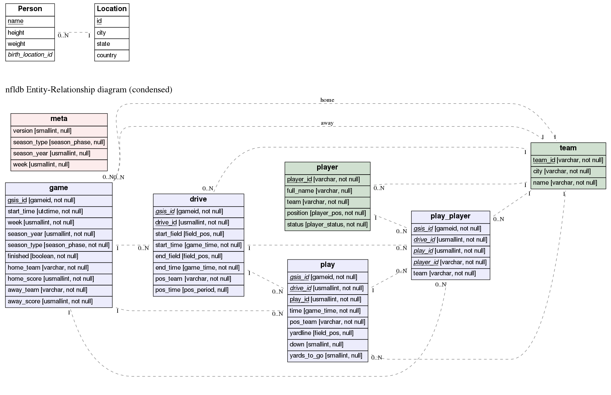

# ER図
テキスト情報からER図を描画できる[BurntSushi/erd](https://github.com/BurntSushi/erd)コマンドを使えるようにした

## how to

#### ER図のテキストを編集
`src/*.er` ファイルを編集する

```
$ cat src/example/001_example.er
```

#### テキスト情報をerdコマンドを使って画像に変換

```
$ make generate
```

## artifacts
変換の結果以下のような画像ファイルが生成されます

```
$ls img/example
001_example.png 002_example.png all_erd.png
```




